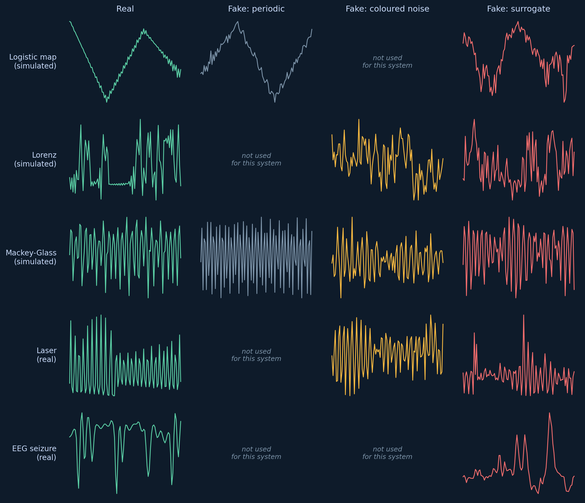
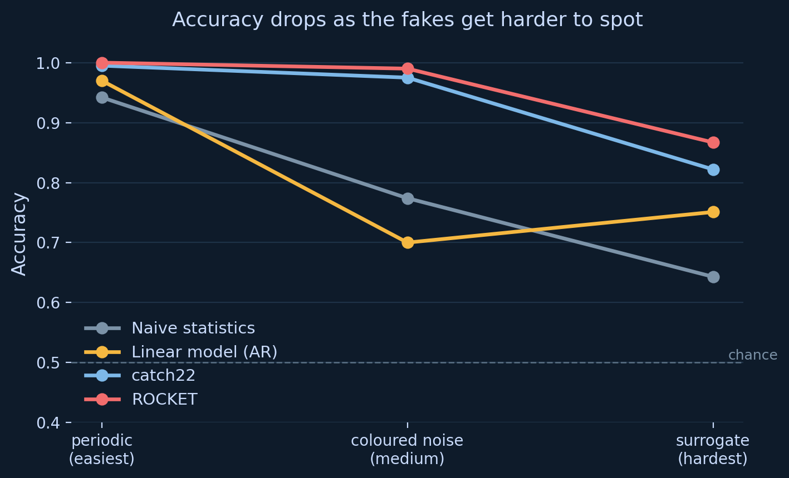

# A benchmark for detecting dynamical structure in time series

Part of an Interdisciplinary Special Project (PHYS3888, University of Sydney)
building a new benchmark database for time series classification, aimed at
problems that cannot be solved by shape matching alone.

Supervised by A/Prof Ben Fulcher (School of Physics) with Eli Muller
(Faculty of Medicine and Health).

---

## The problem

The standard benchmark used to evaluate time series classification
algorithms consists largely of **pattern problems**: fixed-length windows
where classes differ by shape, and where that shape sits in the window
matters. Leaf outlines, gestures, heartbeats.

Physical systems produce **process problems**: the recording is an
arbitrary sample from a system that is already running. Where you started
recording carries no information. Classes differ by the *rule generating
the data*, not by any shape in the window.

Existing benchmarks contain very few of these, so it is not known how well
current algorithms handle them.

## What this repository contains

A confound-controlled dataset for one such property: detecting genuine
nonlinear / deterministic structure (chaos). Every positive signal is
paired with control signals constructed to match it on progressively more
properties, so that classification cannot succeed through simple
shortcuts.

| Control type | Matches the positive on | Difficulty |
|---|---|---|
| `periodic` | broad signal character | easiest |
| `coloured_noise` | power spectrum | medium |
| `iaaft_surrogate` | power spectrum **and** amplitude distribution | hardest |

All series are z-normalised and resampled to 100 points, so mean, variance
and length carry no information.

### What "real vs fake" actually looks like



One example per system. Note that not every system uses every control
type — Lorenz and the laser data have no periodic control, and EEG uses
only the surrogate, since those systems don't have a natural low-effort
"obviously fake" version. By eye, the surrogate column is often almost
indistinguishable from the real signal — that's the point.

## Dataset

`data/chaos_benchmark_v2.csv` — 1360 series of 100 points, from **5
sources**.

| Domain | System | Positive class | Controls used |
|---|---|---|---|
| simulated | logistic map (r ≈ 3.57–3.62) | chaotic | surrogate, periodic |
| simulated | Lorenz (ρ = 28) | chaotic | surrogate, coloured noise |
| simulated | Mackey-Glass (τ = 17) | chaotic | surrogate, coloured noise, periodic |
| real | Santa Fe far-infrared laser | chaotic | surrogate, coloured noise |
| real | Bonn EEG (seizure + healthy) | nonlinear (contested) | surrogate |

80 series per class per system.

**Columns**: `id`, `system`, `domain`, `label`, `class_type`,
`label_source`, `lyapunov_exponent`, `t0`–`t99`.

### Label provenance

The `label_source` column records how each label was established, because
they are not equally certain:

- `analytic_lyapunov` — closed-form Lyapunov exponent (logistic map)
- `numerical_lyapunov` — computed via tangent-space (Lorenz: 1.04,
  literature ≈ 0.91) or trajectory separation (Mackey-Glass τ=17: 0.0095,
  literature ≈ 0.006)
- `published_domain_knowledge` — laser data, an established chaotic benchmark
- `contested_literature` — EEG. Whether EEG reflects deterministic chaos is
  **actively disputed**, so these are labelled `nonlinear_contested`, not
  `chaotic`, and should not be used as chaos ground truth
- `constructed_surrogate` / `constructed_stochastic` — the controls

## Results

**4 algorithms**, chosen to each answer a different question, tested with
5-fold cross-validation:

| Algorithm | What it tests | Overall accuracy |
|---|---|---|
| Naive statistics (mean/std/lag-1 autocorrelation) | Is this dataset trivially easy? | 0.695 |
| Linear AR(5) model | Is the structure explainable by a linear model? | 0.760 |
| catch22 (feature-based, built by Ben) | Can a physics-aware feature set detect it? | 0.875 |
| ROCKET (convolution-based) | Can a generic state-of-the-art method detect it? | 0.899 |

### Accuracy as the fakes get harder



Every method degrades as the controls match more properties, and every
method finds the surrogate hardest. That consistency is the main evidence
the confound design works.

### Findings

1. **The confound controls work.** All four methods drop as the controls
   get harder, in the same order. The difficulty is engineered, not
   accidental.

2. **The linear baseline is the key theoretical control.** IAAFT
   surrogates preserve everything a *linear* process can explain, so a
   properly fitted AR(5) model is the honest test for "is this really
   nonlinear structure." It reaches only 0.751 against surrogates, while
   catch22 reaches 0.822 and ROCKET 0.867 — evidence that genuinely
   nonlinear structure is being detected, beyond what a linear model
   can capture.

3. **A generic method (ROCKET) beats the physics-aware one (catch22).**
   0.867 vs 0.822 on the hardest controls. ROCKET has no dynamics-specific
   design. The supported claim is *"methods that capture real temporal
   structure succeed, while naive statistics and shape/distance-based
   comparison fail"* — not "physics-aware methods win."

4. **catch22 does not generalise across systems.** Leave-one-system-out
   (train on 5 systems, test on the 6th, completely unseen) drops average
   accuracy to **0.550** — barely above chance — compared to 0.875 when
   all systems are seen during training. On the logistic map specifically
   it falls to **0.392, below chance**, meaning the model learned a rule
   from the other systems that is actively wrong for that one. This is
   strong evidence catch22 is partly learning system-specific fingerprints
   rather than a transferable notion of chaos. See
   `src/leave_one_domain_out_test.py`.

### Limitations

- The AR(5) baseline does not degrade monotonically: it drops from 0.970
  (periodic) to 0.700 (coloured noise), then rises to 0.751 (surrogate).
  This is unexpected — in theory it should keep dropping — and is not yet
  explained. Leading hypothesis: IAAFT convergence is imperfect on
  100-point windows. **Open question for further investigation.**
- No nonlinear-but-non-chaotic positives, so "nonlinear" and "chaotic"
  are not separated in this version.
- Real-data positives (laser, EEG) have no computed Lyapunov ground truth.
- EEG labels are deliberately conservative (`nonlinear_contested`) given
  genuine scientific dispute over whether EEG reflects true chaos.
- Generalisation is poor (see finding 4 above) — this is a genuine
  limitation of the current feature-based approach, not yet resolved.

## Usage

```bash
pip install -r requirements.txt
python download_data.py              # fetches third-party raw data
python src/build_final_dataset.py    # writes data/chaos_benchmark_v2.csv
python src/multi_algorithm_benchmark.py
```

Scripts expect to run from the repository root, and read/write raw data
under `data/`.

## Repository layout

```
src/     current pipeline — 4 scripts, each verified to run from a clean clone
  build_final_dataset.py        dataset generator (seeded, reproducible)
  multi_algorithm_benchmark.py  the 4-algorithm comparison above
  leave_one_domain_out_test.py  cross-system generalisation test (finding 4)
  chaos_decision_tree.py        independent reimplementation of Toker et al.
                                 (2020), used as a second method to cross-check
                                 catch22 on known ground truth

data/      dataset and raw inputs (EEG fetched by download_data.py)
docs/      concept glossary, full write-up, status briefing
docs/figures/  signal gallery and results chart shown above
archive/   superseded scripts and earlier dataset versions, kept for history
           (not maintained — may not run against the current data schema)
```

## Data sources

Raw datasets are **not redistributed here**. `download_data.py` fetches
them from their public sources.

- Santa Fe laser — Hübner, U., Abraham, N. B. & Weiss, C. O.
  *Phys. Rev. A* **40**, 6354 (1989)
- Bonn EEG — Andrzejak, R. G. et al. *Phys. Rev. E* **64**, 061907 (2001)

## References

- Middlehurst, M., Schäfer, P. & Bagnall, A. Bake off redux: a review and
  experimental evaluation of recent time series classification algorithms.
  *Data Mining and Knowledge Discovery* (2024)
- Theiler, J., Eubank, S., Longtin, A., Galdrikian, B. & Farmer, J. D.
  Testing for nonlinearity in time series: the method of surrogate data.
  *Physica D* **58**, 77–94 (1992)
- Schreiber, T. & Schmitz, A. Improved surrogate data for nonlinearity
  tests. *Phys. Rev. Lett.* **77**, 635–638 (1996)
- Toker, D., Sommer, F. T. & D'Esposito, M. A simple method for detecting
  chaos in nature. *Communications Biology* **3**, 11 (2020)
- Lubba, C. H. et al. catch22: CAnonical Time-series CHaracteristics.
  *Data Mining and Knowledge Discovery* **33**, 1821–1852 (2019)
- Dempster, A., Petitjean, F. & Webb, G. I. ROCKET: exceptionally fast and
  accurate time series classification using random convolutional kernels.
  *Data Mining and Knowledge Discovery* **34**, 1454–1495 (2020)
- Owens, N. & Fulcher, B. Parameter inference from a non-stationary unknown
  process. *Chaos* **34**, 101501 (2024)
- Strogatz, S. *Nonlinear Dynamics and Chaos*. Westview Press (2014)

## Status

Work in progress, semester 2 2026. Results are preliminary and the
dataset is expected to change.
